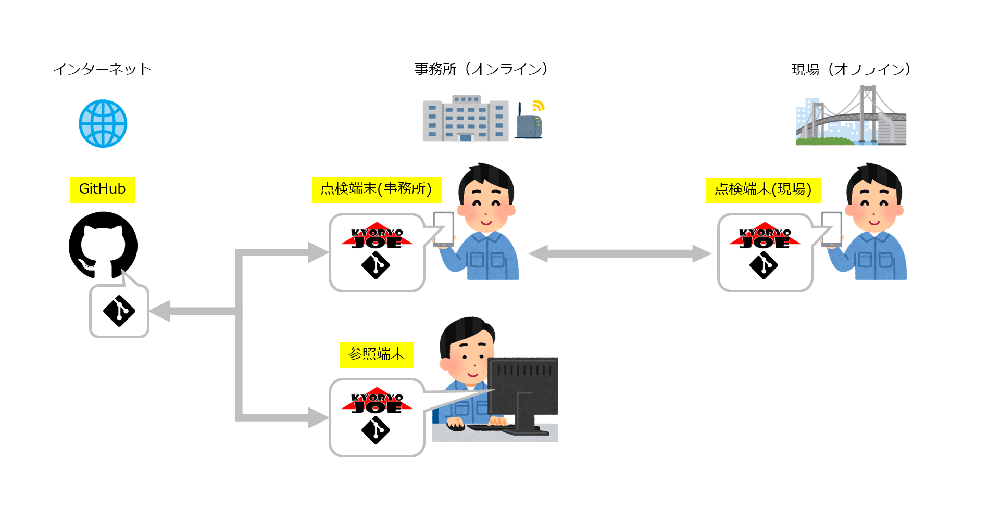

KyoRyoJoe/Doc
===========

概要
----

[kyoryojoe](https://github.com/kyoryojoe/app)は地方自治体による直営橋梁点検の業務をサポートする[オープンソースソフトウェア](https://ja.wikipedia.org/wiki/オープンソースソフトウェア)です。
[ライセンス](doc/license.md)の範囲で、どなたでも無償で利用することができます。

KyoRyoJoeを使うことで、点検写真の「全景-点検-損傷」関係を管理します。
これにより、煩雑な写真管理が楽になり、報告書作成にかかる手間が軽減されます。

また、インターネット圏外（オフライン環境）でも、点検可能な設計のため、Android端末にSIM契約は不要です。
（Wifiのある環境でデータを同期します）

動作環境
--------

KyoRyoJoeは点検現場ではAndroid端末を利用して橋梁点検を行います。

報告書の作成は、PC(Windows, Mac, Linux)で行うことを想定しています。
点検権結果データ閲覧のために、PCにもKyoRyoJoeがインストールされていると便利です。

目次
----

* [KyoRyoJoe利用マニュアル](doc/manual.md)
  * 利用マニュアル
* [背景・動機・目的](doc/background.md)
  * KyoRyoJoe開発に至った背景・動機・目的
* [開発に関する情報](doc/development.md)
  * 開発に必要なドキュメント
* [ライセンス](doc/license.md)

