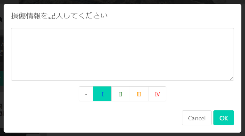

判定画面
===============

現場での点検作業を行うサブ画面です。
各部材の全景写真から紐づく点検写真、点検写真から紐づく損傷写真を撮影します。

点検/損傷写真について
----------------

各写真は、四隅のボタンから必要なアクションを行えます。

* [左上]部材名+画像リンク
* [右上]マッピングボタン
  * 紐づく親写真との位置関係を修正します
* [左下]メモ/判定入力ボタン
  * 写真と合わせて、点検時のメモを残せます
  * 損傷写真の場合は判定区分も記録します
* [右下]アクション
  * 部材全景には[点検を追加]ボタンがあり、クリックすると点検写真を撮影します
  * 点検写真には[損傷を追加]ボタンがあり、クリックすると損傷写真を撮影します

写真のマッピングについて
------------------------

点検写真、損傷写真を撮影する場合、また、マッピング位置を修正する場合、マッピング画面を表示します。
今から撮影する写真が、親写真のどこに位置するのかを記録するものです。

メモの編集（点検写真）
----------------------

点検写真の場合、写真左下のメモボタンから、メモを編集します。
写真だけでは伝わらない記録を自由テキストで記入します。

判定区分の編集（損傷写真）
--------------------------

損傷写真の場合、写真左下の判定入力ボタンから、判定区分とメモを編集します。
写真だけでは伝わらない記録を自由テキストで記入します。

注意点
------

### 点検写真、損傷写真の削除

追加した点検写真、損傷写真は、どちらも削除することはできません。
誤って追加してしまった場合などは、メモ欄に点検不要の旨記載するなど、運用で対処してください。
