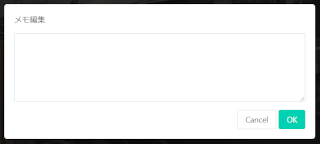

点検画面
===============

現場での点検作業を行う画面です。
橋梁の全景写真、各部材の全景写真を撮影します。

全景写真について
----------------

各写真は、四隅のボタンから必要なアクションを行えます。

* [左上]部材名+画像リンク
* [右上]撮影ボタン
  * 何度でも撮り直しできます
* [左下]メモボタン
  * 写真と合わせて、点検時のメモを残せます
* [右下]アクション
  * 各部材には[点検する]ボタンがあり、クリックすると[判定画面](check_page.md)に遷移します

点検部材の追加
--------------

点検対象の部材は、橋データに基づいて準備されますが、追加で点検したい部材は画面最下部の「点検部材を追加する」ボタンで任意の部材を追加できます。
追加したい部材がない場合、部材名を直接入力することができます。

メモの編集
----------

写真左下のメモボタンから、メモを編集します。
写真だけでは伝わらない記録を自由テキストで記入します。

点検完了
--------

点検を完了する場合、画面上部の「点検完了」ボタン（修正時は「点検修正」）をクリックします。
以下の条件に該当する場合、確認ダイアログが表示されます。

* 点検写真が1枚も撮影されていない
* 点検写真がある場合、損傷写真が1枚も撮影されていない
* 損傷写真がある場合、判定区分が入力されていない

点検漏れの場合は「キャンセル」ボタンをクリックして、点検に戻ってください。

「OK」ボタンをクリックすると、点検完了ダイアログが表示されます。
点検データの判定区分は、部材の判定区分と異なった値を入力できます。
総合的に判断した場合など、合わせて理由をメモ欄に残すことができます。

注意点
------

### 点検データの再編集

点検データは何度でも編集できます。
点検完了後であっても、前巡目であっても変更できます。
過去データの編集の可否は運用ルールで対応してください。

### 点検部材の削除

点検開始時に自動作成される部材、手操作で追加した部材、どちらも削除することはできません。
誤って追加してしまった場合などは、メモ欄に点検不要の旨記載するなど、運用で対処してください。

### 点検未完了時の動作

点検を完了していない状態でも、橋梁名横の矢印アイコン（＜）で[橋梁詳細画面](bridge_page.md) に遷移します。
この時の点検中データは保存されており、いつでも点検を再開できます。

点検を完了していない状態でも、
[業務選択/ツール画面/点検データ同期](work_page.md#点検データ同期) が行えます。
