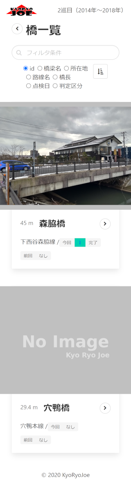

橋梁一覧画面
===============

フィルタ/ソート
---------------

橋梁一覧画面では、一度に100件まで橋梁情報を表示します。
表示されていない橋梁がある場合、フィルタまたはソートを使って表示してください。

### フィルタ

橋梁名、橋梁名カナ、所在地、所在地カナ、路線名から橋梁を検索します。

### ソート
橋梁ID、橋梁名、所在地、路線名、橋長、点検日（今巡目）、判定区分（今巡目）のいずれかから、昇順/降順でソートします。

橋梁概要
--------

### 写真

橋梁の全景写真を表示します。
今巡目の点検で全景写真が撮影されている場合、それが使われます。
今巡目の全景写真がない場合、前巡目の全景写真が使われます。
全巡目の全景写真もない場合は、「NoImage」と表示します。

### 情報

橋長、橋梁名、路線名、所在地、今回判定区分、前回判定区分を表示します。
橋梁名横の矢印アイコン（＞）をクリックすると、当該の[橋梁詳細画面](bridge_page.md) に遷移します。