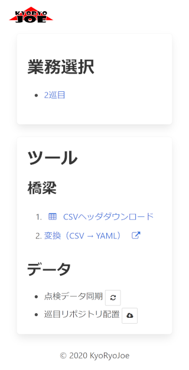
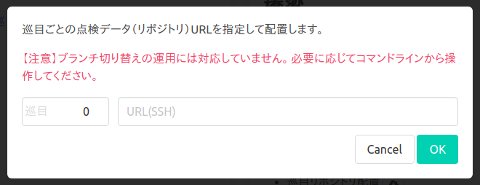
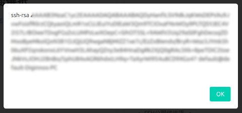

業務選択/ツール画面
===============

業務選択
========

* 配置されている巡目の点検データ一覧が表示されます。
  リンクをクリックすると、選択した巡目で[橋梁一覧画面](list_page.md)に遷移します。
* まだ点検データを配置していない場合「リポジトリがありません。」と表示されます。
* 点検データがサーバに同期されていない巡目には「同期してください」と表示されます。

ツール
======

これらツールは手操作では面倒な作業を補助しますが、あくまで簡易なツールです。
大きなデータ通信が発生する場合があるため、Wifi環境下でご利用ください。

橋梁
----

[橋梁データの作成](../setup/make_bridge_data.md)で利用するリンクです。

データ
------

### 点検データ同期

点検した端末内の変更をGitサーバに同期します。
（PULL→COMMIT→PUSH）

【注意】
* 点検中のデータも同期されます。
* 競合その他の理由で同期に失敗した場合、変更はステージングされ、業務選択の一覧上で検出できなくなります。
* ステージングされていても点検は続行できますが、競合しているファイルはエラーとなり、点検が行えません。
* 競合は手操作で解決し、同期する必要があります。
* ステージングは手操作で同期する必要があります。

### 巡目リポジトリ配置

巡目リポジトリの配置を画面から行えます。

* 巡目：
  * 何巡目のデータかを数値で指定します
* URL：
  * 点検データリポジトリのクローンURL(SSH)を指定します

【注意】
* ブランチの切り替えはここからは行えません。
* 配置後、手操作でブランチを切り替えてください。
* 【参考】[GITブランチの作成と運用](../tips/git_branch.md)

### SSH公開鍵確認

SSH公開鍵の確認を画面から行えます。

セットアップ手順に沿って、SSH鍵を登録してください。
* [巡目リポジトリの作成/SSH公開鍵の登録](../setup/make_junme_repository.md#SSH公開鍵の登録)
